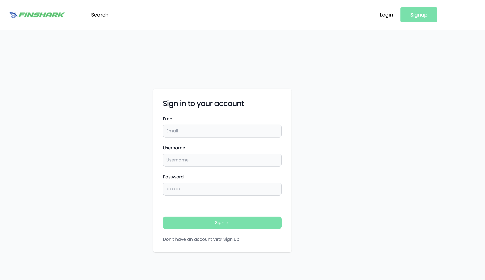
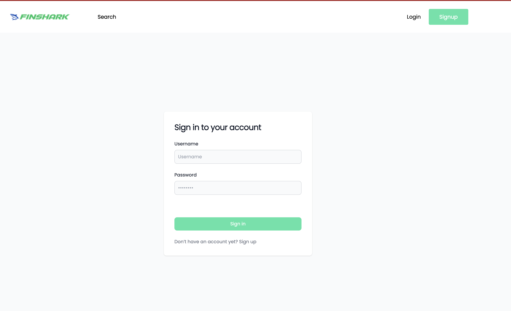

# Build ASP.NET Core Web API .NET 8. Entity Framework-React-TypeScript

Quickly find relevant financial data (in React TypeScript + .NET API)

1. Model
2. Controller
3. DTOs
4. POST-PUT-PATCH-DELETE
5. Asyn/Wait
6. Sorting
7. Pagination

# 💻 Screen Shoot 💻

1==> ASP.NET Core Web API .NET 8 2024 -1. Create Project + Install
Commande to create dotnet project in vs code : 'dotnet new webapi -o api' ==permet de creed un nouveau project webapi, l'argument -o api (regroupe les fichier dans le dossier api)
dotnet watch run .

============API FUNDAMENTAL==========

CREATE : Post READ: Get. UPDATE: Update DELETE : Delete

API allow us to interact with the databases.

=======How can I install and use Entity Framework Core in Visual Studio Code?=====

https://stackoverflow.com/questions/33148698/how-can-i-install-and-use-entity-framework-core-in-visual-studio-code

1==> with commande line

dotnet add package Microsoft.EntityFrameworkCore.SqlServer

2==> VS Code is just an editor. It doesn't install EF (or any packages). You can install EF by editing your csproj file to contain this set of lines.

<ItemGroup>
   <PackageGroup Include="Microsoft.EntityFrameworkCore.SqlServer" Version="1.1.0" />
</ItemGroup>
